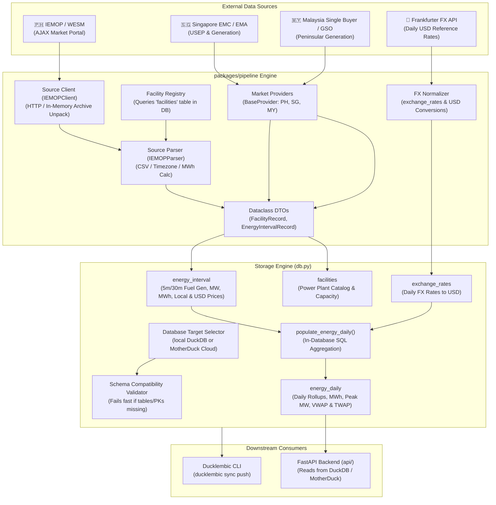

# Pipeline (`packages/pipeline`)

Data ingestion, ETL, classification, and aggregation engine for **OpenElectricity / OpenNEM-SEA**.

The `pipeline` package extracts raw electricity market data from national grid operators across Southeast Asia (such as the Philippines IEMOP/WESM, Singapore EMC, and Malaysia Single Buyer), standardizes fuel technology classifications, synchronizes currency exchange rates, stores high-resolution intervals into DuckDB or MotherDuck Cloud, and performs in-database rollups to serve downstream analytics APIs and dashboards.

---

## Table of Contents

- [Architectural Principles & Boundaries](#architectural-principles--boundaries)
- [Architecture & High-Level Abstractions](#architecture--high-level-abstractions)
- [Package Structure](#package-structure)
- [Core Abstractions](#core-abstractions)
  - [1. Dataclass Domain Models (`pipeline.models`)](#1-dataclass-domain-models-pipelinemodels)
  - [2. Source Clients (`pipeline.iemop_client`)](#2-source-clients-pipelineiemop_client)
  - [3. Source-Specific Parsers (`pipeline.parsers`)](#3-source-specific-parsers-pipelineparsers)
  - [4. Facility Resolution & Fuel Classification (`pipeline.generator_registry`)](#4-facility-resolution--fuel-classification-pipelinegenerator_registry)
  - [5. Market Provider Lifecycle (`pipeline.providers`)](#5-market-provider-lifecycle-pipelineproviders)
  - [6. Storage Engine & SQL Rollups (`pipeline.db`)](#6-storage-engine--sql-rollups-pipelinedb)
  - [7. Schema Compatibility Validation (`pipeline.schema`)](#7-schema-compatibility-validation-pipelineschema)
  - [8. FX Rate Normalization (`pipeline.fx`)](#8-fx-rate-normalization-pipelinefx)
- [Database Schema & Lean Data Model](#database-schema--lean-data-model)
- [CLI Reference & Usage](#cli-reference--usage)
  - [Daily Incremental Sync (`ingest latest`)](#daily-incremental-sync-ingest-latest)
  - [Historical Backfill (`ingest backfill`)](#historical-backfill-ingest-backfill)
  - [Facilities Catalog Sync (`ingest sync-facilities`)](#facilities-catalog-sync-ingest-sync-facilities)
  - [Database Inspection (`ingest inspect`)](#database-inspection-ingest-inspect)
- [Automation & CI/CD (GitHub Actions)](#automation--cicd-github-actions)
- [Testing & Verification](#testing--verification)

---

## Architectural Principles & Boundaries

1. **Decoupled Database Access**:
   - The pipeline can write directly to **either** local DuckDB (`open_nem_ph.duckdb`) or **MotherDuck Cloud** (`md:open_electricity_db`).
   - Easily configured via `--target local|motherduck` (or `DB_TARGET` environment variable).
   - The pipeline **never synchronizes/replicates** tables between local and remote — database sync is strictly the responsibility of `ducklembic sync push`.

2. **Decoupled from API Server**:
   - The `api` server does not import or depend on `pipeline`.
   - Pipeline scraping dependencies (`requests`, `httpx`, `rich`, `typer`) are excluded from the serverless API runtime requirements.
   - API integration tests are isolated in `api/tests/`.

3. **Schema Validation over Automatic Migrations**:
   - The pipeline **never runs schema migrations automatically** (migrations can be destructive).
   - On startup, the pipeline validates that the target database contains all expected base tables, columns, and primary keys.
   - If a table or column is missing or drifted, it fails fast with a clear message: `"Run 'uv run ducklembic migrate' to initialize or update the database schema."`

4. **DuckDB Lock Management**:
   - Acquiring a local DuckDB write connection includes exponential backoff retry logic (3 attempts: 1s, 2s, 4s) to handle temporary locks from concurrent processes cleanly.

5. **Single Source of Truth for Facilities**:
   - Generator resolution queries the `facilities` table in DuckDB directly.
   - Unrecognized generators are strictly tagged `'unclassified'`. **No blanket peaker fallbacks** to oil, diesel, or gas.

---

## Architecture & High-Level Abstractions



---

## Package Structure

```
packages/pipeline/
├── README.md                           # Package documentation (this file)
├── pyproject.toml                      # Build specification, dependencies, and CLI entrypoints
├── pipeline/
│   ├── __init__.py                     # Package init
│   ├── config.py                       # Market configurations, currencies, timezones, paths
│   ├── models.py                       # Dataclass domain models (FacilityRecord, EnergyIntervalRecord, etc.)
│   ├── schema.py                       # Database schema validator & SchemaMismatchError
│   ├── db.py                           # DuckDB & MotherDuck database storage engine
│   ├── fx.py                           # Foreign exchange rates fetcher and USD normalizer
│   ├── generator_registry.py           # Facility registry querying database facilities table
│   ├── iemop_client.py                 # IEMOP HTTP client, archive scraper, and CSV extractor
│   ├── ingest.py                       # CLI application (latest, backfill, sync-facilities, inspect)
│   ├── parsers/                        # Source-specific market data parsers
│   │   ├── __init__.py
│   │   └── iemop.py                    # IEMOP RTD CSV parser to EnergyIntervalRecord
│   └── providers/                      # National market provider implementations
│       ├── __init__.py
│       ├── base.py                     # BaseProvider abstract base class
│       ├── ph_iemop.py                 # Philippines IEMOP/WESM provider
│       ├── sg_emc.py                   # Singapore EMC / EMA provider
│       └── my_singlebuyer.py           # Malaysia Single Buyer provider
└── tests/
    └── test_pipeline.py                # Comprehensive pipeline unit and integration tests
```

---

## Core Abstractions

### 1. Dataclass Domain Models (`pipeline.models`)
Exact 1-to-1 representation of DuckDB tables:
- `FacilityRecord`: `country_code`, `resource_id`, `facility_name`, `region`, `fuel_tech`, `capacity_mw`, `is_renewable`, `emissions_factor`, `status`
- `EnergyIntervalRecord`: `country_code`, `interval_start` (timezone-aware datetime), `region`, `fuel_tech`, `generation_mw`, `energy_mwh`, `price_local`, `price_dollar`
- `EnergyDailyRecord`: `country_code`, `date`, `region`, `fuel_tech`, `energy_mwh`, `avg_generation_mw`, `peak_generation_mw`, `vwap_price_local`, `twap_price_local`, `vwap_price_dollar`, `twap_price_dollar`
- `ExchangeRateRecord`: `date`, `currency`, `rate_to_usd`

### 2. Source Clients (`pipeline.iemop_client`)
Handles pure transport and I/O with market portals without database awareness:
- Discovers available archive files for given dates or ranges.
- Downloads files into memory streams and decompresses archives (ZIP/CSV) without disk temporary files.

### 3. Source-Specific Parsers (`pipeline.parsers`)
Decoupled parsers dedicated to interpreting raw data formats:
- `IEMOPParser`: Reads RTD CSV lines, filters generator records (`RESOURCE_TYPE == 'G'`), converts timestamps to ISO 8601 with `+08:00` offset, calculates interval energy ($MW \times \frac{5}{60}$), and returns `EnergyIntervalRecord`s.

### 4. Facility Resolution & Fuel Classification (`pipeline.generator_registry`)
- Queries the `facilities` table in DuckDB as the single source of truth.
- Applies regex heuristics with prefix stripping to match facility names.
- **Strict Domain Safety**: If fuel technology cannot be confirmed, it is tagged `'unclassified'`. No fallback to coal, gas, or oil.

### 5. Market Provider Lifecycle (`pipeline.providers`)
All country modules implement `BaseProvider` (`pipeline/providers/base.py`):
```python
class BaseProvider(ABC):
    country_code: str

    @abstractmethod
    def fetch_facilities(self, conn: Optional[Any] = None) -> List[FacilityRecord]: ...

    @abstractmethod
    def fetch_energy_intervals(
        self,
        start_date: Optional[date] = None,
        end_date: Optional[date] = None,
        days: int = 2,
        conn: Optional[Any] = None,
    ) -> List[EnergyIntervalRecord]: ...
```

### 6. Storage Engine & SQL Rollups (`pipeline.db`)
- Manages connections to either local DuckDB (`open_nem_ph.duckdb`) or MotherDuck Cloud.
- Validates database schema on connection.
- Includes connection lock retry logic with exponential backoff.
- Target operations:
  - `upsert_facilities(records)`
  - `upsert_energy_interval(records)` (atomic transaction per batch)
  - `populate_energy_daily(country_code, start_date, end_date)` (in-database SQL aggregation calculating daily MWh, peak/avg MW, VWAP, and TWAP)
  - `upsert_exchange_rates(records)`

### 7. Schema Compatibility Validation (`pipeline.schema`)
- Inspects physical base tables (`table_type = 'BASE TABLE'`) in `information_schema.tables`.
- Verifies columns and data types in `information_schema.columns`.
- Verifies primary key constraints in `duckdb_constraints()`.
- Raises `SchemaMismatchError` with explicit instructions if database migrations are missing.

---

## CLI Reference & Usage

Run the pipeline via `uv`:

### Daily Incremental Sync (`ingest latest`)
Triggered daily by CI/CD or locally to sync the past 2 days:
```bash
# Ingest latest data into local DuckDB (default)
uv run ingest latest

# Ingest latest data directly into MotherDuck Cloud
uv run ingest latest --target motherduck

# Ingest latest for a specific country with custom days
uv run ingest latest --country SG --days 3
```

### Historical Backfill (`ingest backfill`)
Used for historical backfills across custom date ranges:
```bash
# Backfill January 2024 for Philippines into local DuckDB
uv run ingest backfill --country PH --start-date 2024-01-01 --end-date 2024-01-31

# Backfill directly into MotherDuck Cloud
uv run ingest backfill --target motherduck --country PH --start-date 2024-01-01 --end-date 2024-01-31

# Backfill with max files limit for testing
uv run ingest backfill --country PH --start-date 2026-03-01 --end-date 2026-03-02 --max-files 2
```

### Facilities Catalog Sync (`ingest sync-facilities`)
Re-syncs generator catalog entries across countries:
```bash
uv run ingest sync-facilities --country ALL
uv run ingest sync-facilities --target motherduck --country PH
```

### Database Inspection (`ingest inspect`)
Interactive CLI diagnostic inspector:
```bash
# Inspect local database
uv run ingest inspect --country PH

# Inspect MotherDuck Cloud database
uv run ingest inspect --target motherduck --country PH

# Inspect specific table samples
uv run ingest inspect --table facilities --limit 10
uv run ingest inspect --table energy_interval --region LUZON --limit 15
```

---

## Automation & CI/CD (GitHub Actions)

The scheduled pipeline is defined in [`.github/workflows/daily_pipeline.yml`](../../.github/workflows/daily_pipeline.yml):
- **Schedule**: Runs daily at `01:00 UTC` (`09:00 AM PHT`).
- **Execution**: Runs `uv run ingest latest --target motherduck --days 2`.
- **Manual Triggers**: Supports manual dispatch with modes: `latest`, `backfill`, `sync-facilities`, or `migrate`.
- **Cloud Sync & Migrations**: Schema migrations are run via `uv run ducklembic migrate --mode motherduck`.

---

## Testing & Verification

Workspace code verification invariant:

```bash
# Format check
uv run ruff format --check

# Lint check
uv run ruff check

# Type check
uv run ty check

# Run pipeline unit tests
uv run pytest packages/pipeline/tests

# Run API server tests
uv run pytest api/tests
```
All tools must report **0 errors**.
