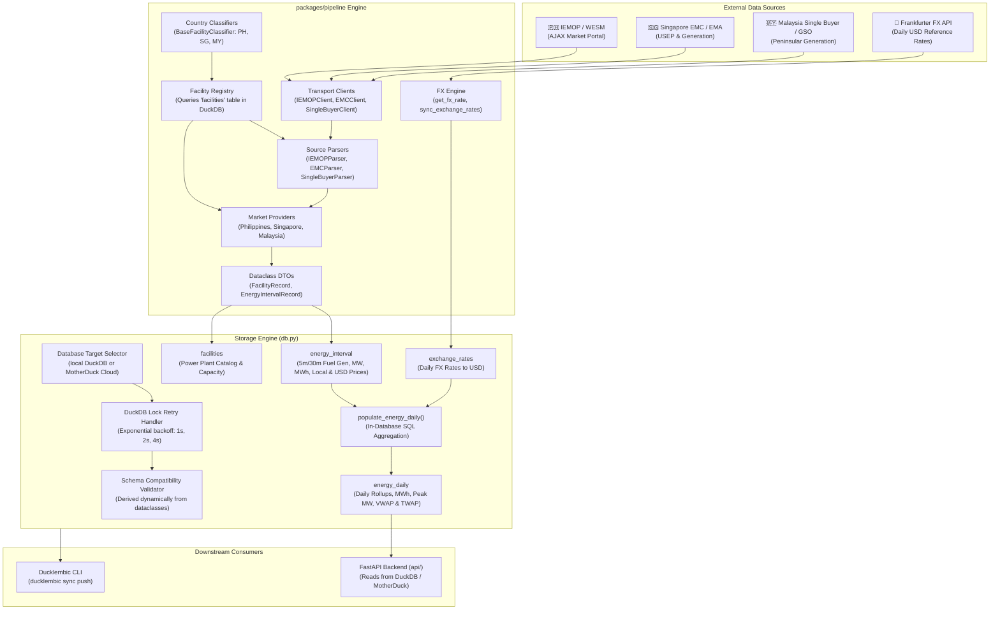

# Pipeline (`packages/pipeline`)

Data ingestion, ETL, classification, and aggregation engine for **OpenElectricity / OpenNEM-SEA**.

The `pipeline` package extracts raw electricity market data from national grid operators across Southeast Asia (such as the Philippines IEMOP/WESM, Singapore EMC, and Malaysia Single Buyer), standardizes fuel technology classifications across multi-country grids, synchronizes currency exchange rates, stores high-resolution intervals into DuckDB or MotherDuck Cloud, and performs in-database rollups to serve downstream analytics APIs and dashboards.

---

## Table of Contents

- [Architectural Principles & Boundaries](#architectural-principles--boundaries)
- [Architecture & High-Level Abstractions](#architecture--high-level-abstractions)
- [Package Structure](#package-structure)
- [Core Abstractions](#core-abstractions)
  - [1. Dataclass Domain Models (`pipeline.models`)](#1-dataclass-domain-models-pipelinemodels)
  - [2. Source Transport Clients (`pipeline.*_client`)](#2-source-transport-clients-pipeline_client)
  - [3. Source-Specific Parsers (`pipeline.parsers`)](#3-source-specific-parsers-pipelineparsers)
  - [4. Multi-Country Facility Classification (`pipeline.classifiers`) & Registry (`pipeline.facility_registry`)](#4-multi-country-facility-classification-pipelineclassifiers--registry-pipelinefacility_registry)
  - [5. Market Provider Lifecycle (`pipeline.providers`)](#5-market-provider-lifecycle-pipelineproviders)
  - [6. Storage Engine & Atomic Upserts (`pipeline.db`)](#6-storage-engine--atomic-upserts-pipelinedb)
  - [7. Dataclass-Derived Schema Validation (`pipeline.schema`)](#7-dataclass-derived-schema-validation-pipelineschema)
  - [8. FX Rate Normalization (`pipeline.fx`)](#8-fx-rate-normalization-pipelinefx)
- [Database Schema & Lean Data Model](#database-schema--lean-data-model)
- [CLI Reference & Usage](#cli-reference--usage)
  - [Daily Incremental Sync (`ingest latest`)](#daily-incremental-sync-ingest-latest)
  - [Historical Backfill (`ingest backfill`)](#historical-backfill-ingest-backfill)
  - [Facilities Catalog Sync (`ingest sync-facilities`)](#facilities-catalog-sync-ingest-sync-facilities)
  - [Database Inspection (`ingest inspect`)](#database-inspection-ingest-inspect)
- [Automation & CI/CD (GitHub Actions)](#automation--cicd-github-actions)
- [Testing & Verification](#testing--verification)

---

## Architectural Principles & Boundaries

1. **Decoupled Database Access**:
   - The pipeline writes directly to **either** local DuckDB (`open_nem_ph.duckdb`) or **MotherDuck Cloud** (`md:open_electricity_db`).
   - Configurable via CLI flag `--target local|motherduck` (or `DB_TARGET` environment variable).
   - The pipeline **never synchronizes/replicates** tables between local and remote — database replication and synchronization is strictly the responsibility of `ducklembic sync push`.

2. **Decoupled from API Server**:
   - The `api` server does not import or depend on `pipeline`.
   - Pipeline scraping and CLI dependencies (`requests`, `httpx`, `rich`, `typer`) are excluded from the serverless API runtime requirements.
   - API integration tests are isolated in `api/tests/`.

3. **Schema Compatibility Validation over Migrations**:
   - The pipeline **never runs schema migrations automatically** (migrations can be destructive).
   - Expected tables, columns, and primary keys are derived dynamically from the dataclass domain models (`TABLE_MODELS`) via `dataclasses.fields()`.
   - On startup, the pipeline validates that the target database contains all expected base tables, columns, and primary keys.
   - If a table or column is missing or drifted, it fails fast with: `"Run 'uv run ducklembic migrate' to initialize or update the database schema."`

4. **DuckDB Lock Management**:
   - Acquiring a local DuckDB write connection includes exponential backoff retry logic (3 attempts: 1s, 2s, 4s) to handle temporary locks from concurrent processes cleanly.

5. **Single Source of Truth for Facilities & Strict Classification**:
   - Facility resolution queries the `facilities` table in DuckDB directly.
   - Ambiguous or unrecognized facilities are strictly tagged `'unclassified'`. **Zero blanket peaker fallbacks** to oil, diesel, or gas.

6. **Fail-Fast Currency Exchange**:
   - No default fallback exchange rates. Missing rates raise `ExchangeRateNotFoundError` or `ExchangeRateSyncError` to prevent silent data corruption.

---

## Architecture & High-Level Abstractions



---

## Package Structure

```
packages/pipeline/
├── README.md                           # Package documentation (this file)
├── pyproject.toml                      # Build specification, dependencies, and CLI entrypoints
├── pipeline/
│   ├── __init__.py                     # Package init
│   ├── config.py                       # Market configurations, currencies, timezones, paths
│   ├── models.py                       # Dataclass domain models (FacilityRecord, EnergyIntervalRecord, etc.)
│   ├── schema.py                       # Database schema validator derived dynamically from dataclasses
│   ├── db.py                           # DuckDB & MotherDuck storage engine with lock retries & transactions
│   ├── fx.py                           # Foreign exchange rates fetcher and USD normalizer (no fallbacks)
│   ├── facility_registry.py            # Generic facility registry querying database facilities table
│   ├── generator_registry.py           # Backward-compatibility alias for facility_registry
│   ├── iemop_client.py                 # IEMOP HTTP client, archive scraper, and CSV extractor
│   ├── emc_client.py                   # Singapore EMC API and CSV catalog client
│   ├── singlebuyer_client.py           # Malaysia Single Buyer & GSO client
│   ├── cli.py                          # Dedicated Typer & Rich CLI app (latest, backfill, sync-facilities, inspect)
│   ├── ingest.py                       # Pipeline runner and orchestration engine (run_country_pipeline)
│   ├── classifiers/                    # Multi-country facility classification strategy
│   │   ├── __init__.py                 # Factory get_classifier_for_country()
│   │   ├── base.py                     # BaseFacilityClassifier & ClassifiedUnit NamedTuple
│   │   ├── ph_wesm.py                  # Philippines WESM facility classifier
│   │   ├── sg_emc.py                   # Singapore EMC facility classifier
│   │   └── my_singlebuyer.py           # Malaysia Single Buyer facility classifier
│   ├── parsers/                        # Source-specific market data parsers
│   │   ├── __init__.py                 # Exports IEMOPParser, EMCParser, SingleBuyerParser
│   │   ├── iemop.py                    # IEMOP RTD CSV parser to EnergyIntervalRecord
│   │   ├── emc.py                      # Singapore EMC USEP, demand, and generation parser
│   │   └── singlebuyer.py              # Malaysia Single Buyer SMP and generation parser
│   └── providers/                      # National market provider implementations
│       ├── __init__.py
│       ├── base.py                     # BaseProvider abstract base class
│       ├── ph_iemop.py                 # Philippines IEMOP/WESM provider
│       ├── sg_emc.py                   # Singapore EMC / EMA provider
│       └── my_singlebuyer.py           # Malaysia Single Buyer provider
└── tests/
    └── test_pipeline.py                # Comprehensive pipeline unit and integration tests
```

---

## Core Abstractions

### 1. Dataclass Domain Models (`pipeline.models`)
Exact 1-to-1 representation of DuckDB tables matching database column names, types, and primary keys:

- `FacilityRecord`:
  - Table: `facilities`, Primary Key: `["country_code", "resource_id"]`
  - Fields: `country_code`, `resource_id`, `facility_name`, `region`, `fuel_tech`, `capacity_mw`, `is_renewable`, `emissions_factor`, `status`
- `EnergyIntervalRecord`:
  - Table: `energy_interval`, Primary Key: `["country_code", "interval_start", "region", "fuel_tech"]`
  - Fields: `country_code`, `interval_start` (timezone-aware datetime, e.g. `+08:00`), `region`, `fuel_tech`, `generation_mw`, `energy_mwh`, `price_local`, `price_dollar`
- `EnergyDailyRecord`:
  - Table: `energy_daily`, Primary Key: `["country_code", "date", "region", "fuel_tech"]`
  - Fields: `country_code`, `date`, `region`, `fuel_tech`, `energy_mwh`, `avg_generation_mw`, `peak_generation_mw`, `vwap_price_local`, `twap_price_local`, `vwap_price_dollar`, `twap_price_dollar`
- `ExchangeRateRecord`:
  - Table: `exchange_rates`, Primary Key: `["date", "currency"]`
  - Fields: `date`, `currency`, `rate_to_usd`
- `IngestRunReport`:
  - Execution summary for CLI reporting: `country_code`, `facilities_synced`, `intervals_synced`, `daily_rollups_updated`, `status`, `error`

### 2. Source Transport Clients (`pipeline.*_client`)
Handles pure transport and I/O with market portals without database awareness:
- `IEMOPClient`: Discovers market run CSV archives for given dates or ranges; streams and unpacks ZIP/CSV files directly in-memory without temporary disk writes.
- `EMCClient`: Interacts with Singapore EMC market portal endpoints for final USEP prices, registered facilities catalogs, and metered generation.
- `SingleBuyerClient`: Queries Malaysia Grid System Operator (GSO) and Single Buyer endpoints for actual and prognostic demand, dispatch, and System Marginal Price (SMP).

### 3. Source-Specific Parsers (`pipeline.parsers`)
Decoupled parsers dedicated to interpreting raw data formats into canonical dataclass records:
- `IEMOPParser`: Reads RTD CSV lines, filters generator records (`RESOURCE_TYPE == 'G'`), standardizes interval timestamps to ISO 8601 with `+08:00` offset, calculates interval energy ($MW \times \frac{5}{60}$), and emits `EnergyIntervalRecord`s.
- `EMCParser`: Parses registered facilities CSVs (RC), USEP price and demand CSVs, and half-hourly metered generation (MG) into `FacilityRecord` and `EnergyIntervalRecord` dataclasses.
- `SingleBuyerParser`: Parses registered power stations, SMP prices, 30-minute day generation mix, and 10-minute real-time GSO generation feeds into `FacilityRecord` and `EnergyIntervalRecord` dataclasses.

### 4. Multi-Country Facility Classification (`pipeline.classifiers`) & Registry (`pipeline.facility_registry`)
- **Strategy Pattern (`pipeline.classifiers`)**:
  - `BaseFacilityClassifier`: Defines `classify_unit(unit_id, unit_name) -> ClassifiedUnit`.
  - `PhilippinesFacilityClassifier`: Handles WESM prefix stripping (`01`, `02`, `1`), grid region resolution (`CLUZ` $\to$ `LUZON`, `CVIS` $\to$ `VISAYAS`, `CMIN` $\to$ `MINDANAO`), and fuel tech heuristics.
  - `SingaporeFacilityClassifier`: Matches EMC generation station identifiers and maps to `SINGAPORE`.
  - `MalaysiaFacilityClassifier`: Handles Single Buyer / GSO power station names and maps to `PENINSULAR`, `SABAH`, or `SARAWAK`.
  - `get_classifier_for_country(country_code)`: Factory returning the designated country classifier.
- **Generic Facility Registry (`pipeline.facility_registry`)**:
  - Queries the `facilities` table in DuckDB as the single source of truth.
  - Delegates country-specific naming rules and fuel heuristics to the respective strategy.
  - Preserved `pipeline.generator_registry` as a backward-compatible alias.
  - **Strict Domain Safety**: Ambiguous units are classified as `'unclassified'`. No blanket peaker fallbacks to coal, gas, or oil.

### 5. Market Provider Lifecycle (`pipeline.providers`)
All country modules implement `BaseProvider` (`pipeline/providers/base.py`):
```python
class BaseProvider(ABC):
    country_code: str

    @abstractmethod
    def fetch_facilities(self, conn: Optional[Any] = None) -> List[FacilityRecord]: ...

    @abstractmethod
    def fetch_energy_intervals(
        self,
        start_date: Optional[date] = None,
        end_date: Optional[date] = None,
        days: int = 2,
        conn: Optional[Any] = None,
    ) -> List[EnergyIntervalRecord]: ...
```

### 6. Storage Engine & Atomic Upserts (`pipeline.db`)
- Manages connections to either local DuckDB (`open_nem_ph.duckdb`) or MotherDuck Cloud.
- Automatic connection lock retry logic with exponential backoff (3 attempts: 1s, 2s, 4s).
- Validates database schema on connection.
- Target operations:
  - `upsert_facilities(records)`
  - `upsert_energy_interval(records)` (executed within an explicit atomic transaction block)
  - `populate_energy_daily(country_code, start_date, end_date)` (in-database SQL aggregation calculating daily MWh, peak/avg MW, VWAP, and TWAP)
  - `upsert_exchange_rates(records)`
- **Zero MotherDuck Push Logic**: Syncing tables to MotherDuck is strictly delegated to `ducklembic sync push`.

### 7. Dataclass-Derived Schema Validation (`pipeline.schema`)
- Derived dynamically from `TABLE_MODELS` using `dataclasses.fields()`.
- Inspects physical base tables (`table_type = 'BASE TABLE'`) in `information_schema.tables`.
- Verifies columns and data types in `information_schema.columns`.
- Verifies primary key constraints in `duckdb_constraints()`.
- Raises `SchemaMismatchError` with clear instructions when migrations are pending.

### 8. FX Rate Normalization (`pipeline.fx`)
- Queries daily rates from `exchange_rates` table.
- Converts local currency prices (PHP, SGD, MYR) to USD.
- Fetches daily reference rates via the Frankfurter FX API.
- **Fail-Fast Integrity**: Removed default fallback dictionaries. Missing rates or API errors raise `ExchangeRateNotFoundError` or `ExchangeRateSyncError` respectively.

---

## Database Schema & Lean Data Model

The DuckDB schema managed by Ducklembic and validated by the pipeline:

| Table | Primary Key | Description |
|---|---|---|
| `facilities` | `(country_code, resource_id)` | Catalog of power generators, fuel tech, capacity (MW), and emissions factor |
| `energy_interval` | `(country_code, interval_start, region, fuel_tech)` | High-resolution intervals (5m/30m) with generation (MW), energy (MWh), and local/USD prices |
| `energy_daily` | `(country_code, date, region, fuel_tech)` | Aggregated daily rollups with total energy (MWh), avg/peak MW, VWAP, and TWAP prices |
| `exchange_rates` | `(date, currency)` | Daily currency exchange rates against USD |

---

## CLI Reference & Usage

Run the pipeline via `uv`:

### Daily Incremental Sync (`ingest latest`)
Triggered daily by CI/CD or locally to sync recent intervals:
```bash
# Ingest latest data into local DuckDB (default, past 2 days)
uv run ingest latest

# Ingest latest data directly into MotherDuck Cloud
uv run ingest latest --target motherduck

# Ingest latest for a specific country with custom days
uv run ingest latest --country SG --days 3
```

### Historical Backfill (`ingest backfill`)
Used for historical backfills across custom date ranges:
```bash
# Backfill January 2024 for Philippines into local DuckDB
uv run ingest backfill --country PH --start-date 2024-01-01 --end-date 2024-01-31

# Backfill directly into MotherDuck Cloud
uv run ingest backfill --target motherduck --country PH --start-date 2024-01-01 --end-date 2024-01-31

# Backfill with max files limit for testing
uv run ingest backfill --country PH --start-date 2026-03-01 --end-date 2026-03-02 --max-files 2
```

### Facilities Catalog Sync (`ingest sync-facilities`)
Re-syncs generator catalog entries across countries:
```bash
uv run ingest sync-facilities --country ALL
uv run ingest sync-facilities --target motherduck --country PH
```

### Database Inspection (`ingest inspect`)
Interactive CLI diagnostic inspector:
```bash
# Inspect local database
uv run ingest inspect --country PH

# Inspect MotherDuck Cloud database
uv run ingest inspect --target motherduck --country PH

# Inspect specific table samples
uv run ingest inspect --table facilities --limit 10
uv run ingest inspect --table energy_interval --region LUZON --limit 15
```

---

## Automation & CI/CD (GitHub Actions)

The scheduled pipeline is defined in [`.github/workflows/daily_pipeline.yml`](../../.github/workflows/daily_pipeline.yml):
- **Schedule**: Runs daily at `01:00 UTC` (`09:00 AM UTC+8` Manila / Singapore / Kuala Lumpur).
- **Execution**: Runs `uv run ingest latest --target motherduck --country ALL --days 2`.
- **Manual Triggers**: Supports manual dispatch with modes: `latest`, `backfill`, `sync-facilities`, `migrate`, or `inspect`, with custom country and date filters.
- **Cloud Migrations**: Schema migrations are automatically run prior to ingestion via `uv run ducklembic migrate --mode motherduck`.
- **Verification & Summary**: Runs table inspection on completion and generates a GitHub Step Summary.

---

## Testing & Verification

Workspace code verification invariant:

```bash
# Format check
uv run ruff format --check

# Lint check
uv run ruff check

# Type check
uv run ty check

# Run all workspace tests (pipeline, ducklembic, and api)
uv run pytest
```
All tools must report **0 errors**.
